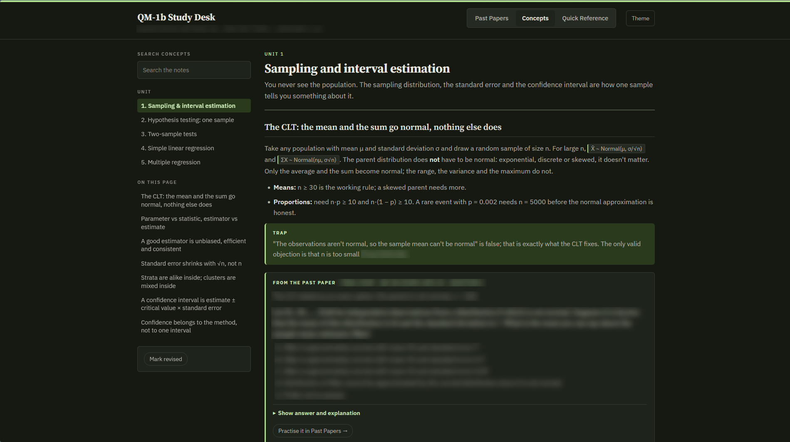
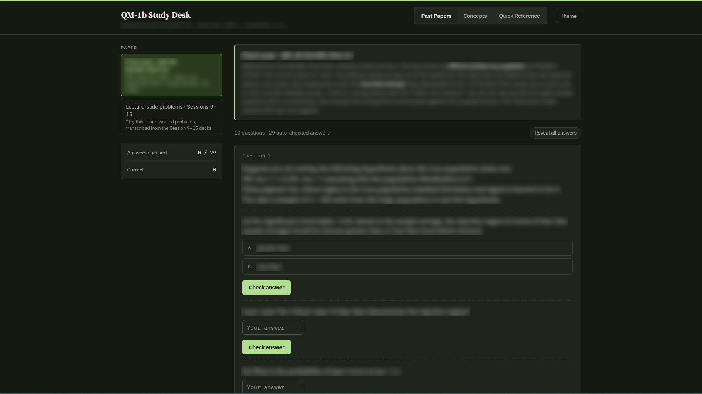

# Study Desk Generator

[](../../releases/latest)

> [!NOTE]
> Hello! (from a real person). This is all (obviously) AI generated slop. Please use it at your own discretion. I made this solely for my own personal use, so I can't assure it'll work for everyone. I did this to help me study for my MBA and maybe someone will find a use for this! I'll keep improving it, subject to my own requirements.

### What your study desk will look like :)



A Claude skill that turns your course material — past papers, official solutions, readings, slides —
into **one offline HTML revision desk**. Past papers are digitized **word for word** with their
official solutions and a worked explanation; a practice-question bank, concept notes and a quick
reference are generated around them. Every quantitative solution comes with its **Excel formulae**,
recalculated and checked.

You open the desk in any browser, on a laptop or a phone, with no internet. Your progress (answers,
flags, drafts) is saved in that browser.

---

## What it's useful for

- **Exam revision for a course with past papers.** Practise each paper as it was printed, then check
  your attempt against the official solution and an explanation of the concept behind it.
- **Quantitative subjects** (operations, finance, statistics, economics). Every numeric working is
  shown as Excel formulae you can reproduce, plus a workbook with all of them.
- **Turning a pile of scans into something searchable.** Scanned papers and handwritten solution
  sheets are OCR'd, checked against the page images and made searchable.
- **Drilling weak areas.** The question bank is written in the style of your papers, tagged by unit,
  topic and difficulty, with explanations that say why the tempting wrong answer is wrong.
- **Sharing with a study group.** It's one file: send it, and everyone gets the same desk with their
  own progress.

What it is *not*: a summariser that paraphrases your papers. The questions you were set are kept
exactly as printed, and the build refuses to ship anything that differs from the source.

---

## What you get

**`<Course> Study Desk.html`** — a single self-contained file with up to four tabs:

| Tab | What's in it |
|---|---|
| **Past Papers** | Each paper as printed (text, tables, figures, marks). MCQs you can answer and check; written questions with a draft box that saves as you type, then *Show model outline* for the official solution, the explanation and the Excel working. *Reveal all answers* for quick review. |
| **Question Bank** | Generated practice questions by unit and topic, filterable by difficulty and status (unattempted, got wrong, flagged), searchable, with *Shuffle order*. Questions built on a past-paper problem show that problem verbatim in a collapsible box. |
| **Concepts** | Chapter-by-chapter revision notes with definitions, comparison tables, diagrams and an *In the exam* box per unit; searchable. |
| **Quick Reference** | Frameworks, common traps, and a coverage table of how many questions each unit has. |

Plus:

- **`<Course> Study Desk - Excel workings.xlsx`** — every quantitative working, one sheet per question,
  with live formulae.
- **`work/compare.html`** — each original page crop beside its digitized version, riskiest first.
  Use it to check the digitization yourself in a few minutes.

Each desk gets its own colour, so several courses' desks are easy to tell apart. Light and dark mode
follow your system (or toggle *Theme*).

---

## Install

**In Claude (web or desktop app):**

1. Download `study-desk.zip` from the [latest release](../../releases/latest).
2. In Claude, open **Settings → Capabilities → Skills**, upload the zip, and turn the skill on.

If only `SKILL.md` ends up installed (for example, saved from a chat), it still works: the first
build step clones the newest **v2.x** release of this repository to get the scripts, so script fixes
reach you without reinstalling the skill.

**In Claude Code:** copy the `study-desk/` folder into your skills directory
(`~/.claude/skills/study-desk/`).

---

## How to use it

### 1. Gather your material

Attach whatever you have to a Claude conversation:

| Material | Formats | Notes |
|---|---|---|
| Past papers, practice sets, quizzes | PDF (typed or scanned), photos, Word | The more recent papers, the better the bank matches your exam's style. |
| Official solutions / answer keys | PDF, photos of handwritten sheets | Matched to papers automatically by file name; name them like `midterm_2025_solutions.pdf`. |
| Readings, slides, notes | PDF, PowerPoint, Word, text | Used for the concept notes and the bank. |
| Data or exhibits | Excel, CSV | Kept as tables. |

### 2. Ask for a desk

Say what you want and name the course. For example:

> Build a study desk for Operations Management I from these files. Units 1–8. I want past papers
> and a question bank.

> Make a study desk for Corporate Finance: concept notes and practice questions for the midterm
> chapters (1–6), ~25 questions per chapter, mostly hard.

> Digitize these three past papers with their solutions into a study desk. Just the Past Papers tab.

If you don't say which sections you want, Claude asks (concept notes, question bank, past papers,
quick reference). It states the scope it's working to (units, questions per unit) before building.

### 3. What happens while it builds

1. **Ingest** — the scripts read every file, extract the text exactly, run OCR on scans, and find
   tables, figures and running headers. Claude looks only at what needs eyes: table and figure crops,
   and "review strips" of OCR'd lines (every number and every low-confidence word) to correct.
2. **Scaffold** — every printed question, table, figure and official solution is copied into the desk
   automatically. Claude confirms the few guesses the script flags.
3. **Write** — Claude writes the explanations, the Excel workings, the concept notes and the question
   bank.
4. **Build and check** — the desk is built only if every check passes (see below), then smoke-tested
   in a headless browser.

You get the desk, the Excel workbook, and a short note: what's in each tab, which official solutions
were missing, and any answer keys Claude thinks are wrong.

### 4. Check it and use it

- Open `work/compare.html` (Claude can send it) and skim the top rows: originals beside the
  digitized versions, riskiest first.
- Open the desk. Start with a past paper under exam conditions, then check answers; use the bank's
  *Got wrong* and *Flagged* filters to drill weak spots; read the unit's concept notes when stuck.
- Progress lives in your browser. *Reset all progress* clears it. Opening the file in another
  browser or device starts fresh.

### 5. Updating a desk

Ask Claude to add a paper, a unit or more questions to an existing desk. Keep the desk folder (or
send the HTML back): rebuilding keeps the same colour, and your progress survives as long as the
course's storage key is unchanged.

---

## What the build checks

The build refuses to write the desk if any check fails.

| Check | Catches |
|---|---|
| Precision | Paraphrased or invented wording in a question, option or table |
| Recall | A dropped word, sentence, sub-part or whole question |
| Numbers | A changed digit (459 for 450) in text, options or tables — compared as a multiset |
| Tables and figures | A table or figure in the paper that isn't shown with its question |
| Official solutions | The same checks against the solution sheet |
| Excel workings | Formulae recalculated in LibreOffice that disagree with the key, the correct option or the official solution (unless the key is marked as disputed, which the desk shows) |
| Unconfirmed guesses | Anything the scaffold guessed that nobody confirmed |

---

## Running the scripts yourself (without Claude)

Everything Claude runs is a plain Python script, so you can run the pipeline by hand: for debugging,
for a course you prepare manually, or to see how it works.

**Requirements:** Python 3.10+, `poppler-utils` (pdftoppm, pdftotext, pdfimages), `tesseract-ocr`
for scans, LibreOffice for Excel recalculation and Office uploads, and Playwright + Chromium for the
smoke test.

```bash
# Ubuntu / Debian
sudo apt-get install poppler-utils tesseract-ocr libreoffice-calc-nogui
pip install pdfplumber pytesseract openpyxl pillow playwright && python -m playwright install chromium
# macOS
brew install poppler tesseract && brew install --cask libreoffice
pip install pdfplumber pytesseract openpyxl pillow playwright && python -m playwright install chromium
```

Then, from an empty desk folder (`S` is the path to `study-desk/scripts`):

```bash
python3 $S/check_env.py --expect v2                  # a v2.x release, tools present
python3 $S/ingest.py ~/papers/*.pdf ~/slides/*.pptx   # -> sources/, work/summary.txt, work/view/
cat work/summary.txt                                 # what needs checking
python3 $S/scaffold.py                               # -> data/papers/<id>.json
# add data/meta.json, explanations (e_explain), calc blocks, data/concepts/*.json, data/bank/*.json
python3 $S/build_desk.py data -o "OM-I Study Desk.html"
python3 $S/verify.py "OM-I Study Desk.html"
python3 $S/verify.py --compare work/compare.html --top 6 --out work/review.png
```

| Script | Does |
|---|---|
| `check_env.py` | Confirms the scripts suit the `SKILL.md` (`--expect v2` for any v2.x, `--expect v2.1` exactly); installs missing Python packages; reports missing tools. |
| `ingest.py` | Classifies uploads, writes verbatim `sources/<id>.txt`, OCRs scans, inventories tables/figures, writes `work/summary.txt` and the images worth viewing. Options: `--role ID=paper\|solution\|reading`, `--pair SOL=PAPER`. |
| `scaffold.py` | Splits sources into question items and attaches official solutions. Re-run after editing a source; your own fields are kept. |
| `build_desk.py` | Runs every check and the Excel recalculation, writes the desk, the workbook, `work/compare.html` and `work/build_report.txt`. Options: `--sections`, `--theme`, `--check`. |
| `verify.py` | Headless smoke test of the desk; or screenshots of the riskiest compare rows. |

The data format (`meta.json`, papers, concepts, bank, `calc` blocks, diagram blocks) is documented in
[`study-desk/SKILL.md`](study-desk/SKILL.md#data-layout).

**Fixing the structure of a paper:** if a question is split in two or a heading is glued to a
question, add a directive line to `sources/<id>.txt` and re-run `scaffold.py`:
`[[item]]` (next line starts a question), `[[head]]` (next line starts a heading block),
`[[nobreak]]` (next line is not a new question), `[[end]]` (close the current item).

---

## Limitations

- **Handwriting.** Tesseract reads neat handwriting reasonably; messy sheets are flagged for Claude to
  transcribe from the page image, which takes longer.
- **Tables without ruled lines** and **two-column layouts** are detected and flagged for checking
  rather than handled perfectly.
- **Figures in scans** are not detected automatically; Claude spots them on a layout thumbnail and
  crops them.
- Correctness of Claude's own explanations and generated questions is not machine-checked beyond the
  Excel workings. Disputed keys are marked, not hidden.

---

## Repository layout

```
study-desk/              the installable skill (the release zip contains this folder)
  SKILL.md               instructions Claude follows
  scripts/               ingest, scaffold, build_desk, checks, calc, compare, verify, check_env, template, VERSION
tests/                   synthetic fixtures, scripted "Claude" edits, fault injection, OCR evaluation
.github/workflows/       release: tests, then publishes study-desk.zip
```

## Development

**Tests:** `tests/run.sh` generates synthetic papers (typed, scanned, typed solutions,
handwritten-style solutions), runs the whole pipeline, injects 16 realistic mistakes that the
build must catch, and measures OCR accuracy. Run it before every release.

**Versioning.** An installed `SKILL.md` fetches the newest release of its **major** version
(`v2.*`), so every release must keep its major's promise:

- **Minor release (v2.1, v2.2, …):** bug fixes and backward-compatible additions only. Every command,
  option, data field and directive that a v2 `SKILL.md` mentions keeps working. Installed skills pick
  it up automatically.
- **Major release (v3.0):** anything that would break a v2 `SKILL.md` — renamed commands or fields,
  a changed workflow. Ship it with a `SKILL.md` that fetches `'v3.*'` and accepts `v3.*`; installed v2
  skills keep using the newest v2.x until they are updated.

**Releasing:**

1. Change the scripts and/or `SKILL.md`; run `tests/run.sh`.
2. Set `study-desk/scripts/VERSION` to the new tag. For a major release, also change the `v2` in
   `SKILL.md`'s setup step (`'v2.*'` and `v2.*)`) to the new major.
3. Commit, then `git tag v2.2 && git push origin v2.2`. The workflow refuses a tag that disagrees with
   `VERSION` or with the major version `SKILL.md` fetches, runs the tests, and publishes `study-desk.zip`.

Protect `v*` tags in the repository settings (Rules → Rulesets) so a published release can't be moved.

**Never commit real exam papers or solutions.** They are usually not yours to publish; the tests use
synthetic material only.

## License

MIT — see [LICENSE](LICENSE).
